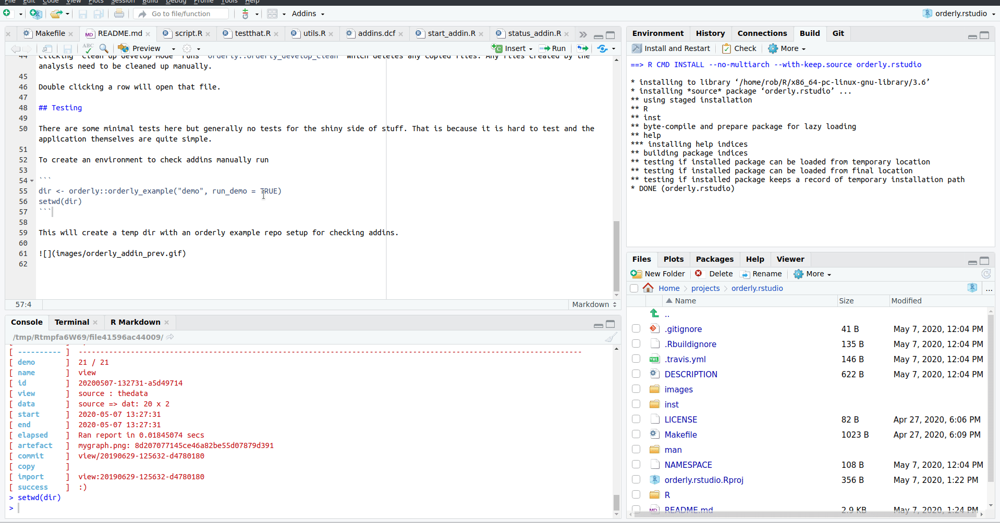

## orderly.rstudio

<!-- badges: start -->
[](https://www.repostatus.org/#concept)
[](https://travis-ci.com/vimc/orderly.rstudio)
[](https://codecov.io/github/vimc/orderly.rstudio?branch=master)
<!-- badges: end -->

RStudio addins for [orderly](https://github.com/vimc/orderly)

## Installation

```
# install.packages("remotes") # if needed
remotes::install_github("vimc/orderly.rstudio")
```

## Setup

Installing the package will make the addins available through the addin menu.


To set a keyboard shortcut to launch the addins go to Tools -> Modify Keyboard Shortcuts...
You can then filter the list of by name and set desired shortcut for the addin.

## Usage

### Start addin

Start addin lists all orderly reports found in the current working directory. The list can be filtered on either date or report name. Clicking the "Open" button will run `orderly::orderly_develop_start` which copies all requied files into the report source directory, loads any data or parameters and sets the working directory to the report source directory. At this point the directory can be developed in directly.

### Status addin

Shows the result of running `orderly::orderly_develop_status` in the current working directory. This shows information about the status of files in the directory. 

This lists the files with three colours
* Blue - files which are not derived
* Green - files which are derived and present, these are the files created by `orderly::orderly_develop_start` or outputs if they have been created.
* Red - files which are derived and not present, these are files which either will be created by `orderly::orderly_develop_start` or are outputs of the analysis.

You can also "Reload dependencies", this will run `orderly::orderly_develop_start` in the current directory. You can use this to create any missing dependencies and to refresh sources should something have changed during development.

Clicking "Clean up develop mode" runs `orderly::orderly_develop_clean` which deletes any copied files. Any files created by the analysis need to be cleaned up manually.

Double clicking a row will open that file.

## Testing

There are some minimal tests here but generally no tests for the shiny side of stuff. That is because it is hard to test and the application themselves are quite simple.

To create an environment to check addins manually run

```
dir <- orderly::orderly_example("demo", run_demo = TRUE)
setwd(dir)
```

This will create a temp dir with an orderly example repo setup for checking addins.


